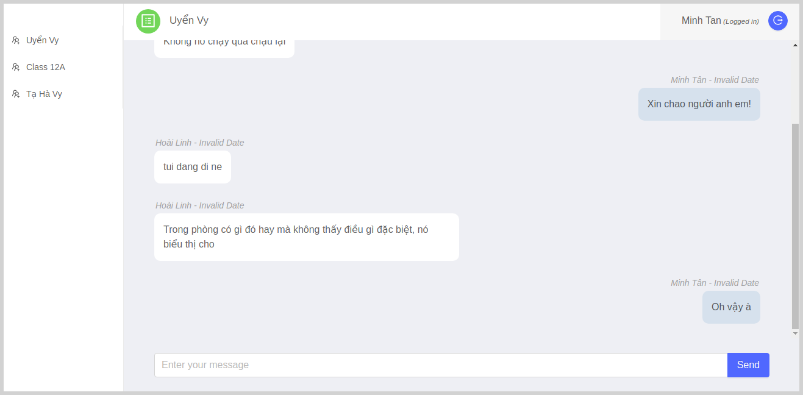

# Chap-app-reactjs

Simple frontend Messenger/ Zalo chat application use ReactJS.

## Features

- Show list of conversations.
- Show message list of each conversation.
- *[updating]*

## Techniques used

- [ReactJS](https://reactjs.org/): is a JavaScript library for building user interfaces. It is maintained by Facebook and a community of individual developers and companies. React can be used as a base in the development of single-page applications.
- [Redux - Thunk middleware](https://redux.js.org/): a predictable state container for JavaScript apps. Redux makes it easy to manage the state of your application.
- [Ant.design](https://ant.design/docs/react/introduce): following the Ant Design specification, we developed a React UI library *antd* that contains a set of high quality components and demos for building rich, interactive user interfaces.

## Installation

- Clone respository.
- Use terminal and cd to the project folder.
- Run `npm install` to install all node modules required.
- Run `npm start` to start website in development environment.
- Enjoy it.

## Screenshot

